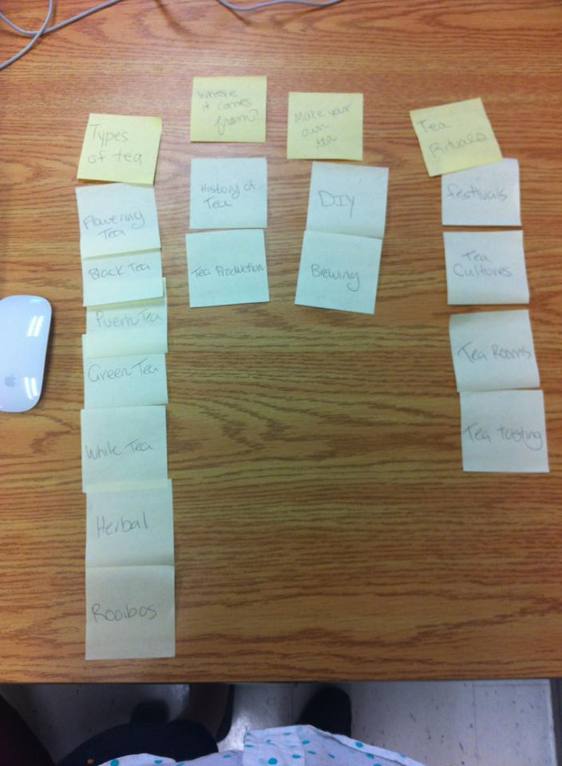
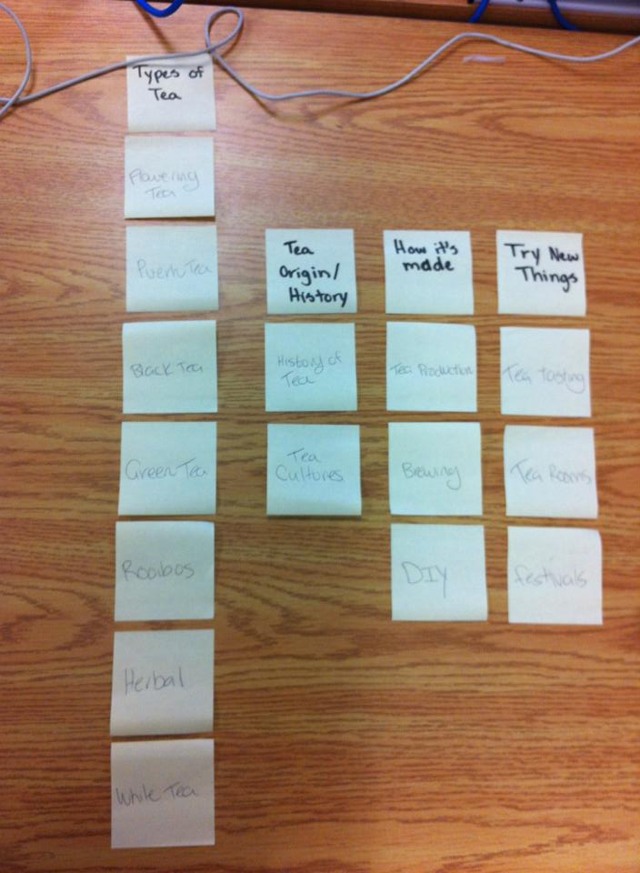

# Card sort report

The purpose of this card sort was to determine common navigation patterns and categories from the content of a large data tea website.

## Specifics

The card sort was conducted by Michelle Lauer on September,12 between the times of 3pm and 6om with the following participants:

- Sarah Voss
- Kelsey MacMillan

### Cards

15 cards were used covering a broad range of applicable content for the website. The following topics were used as cards:

1. History 
2. Production
3. Cultures
4. Brewing 
5. Flowering Tea
6. Black Tea
7. Green Tea
8. White Tea
9. Pu-erh Tea
10. Rooibos
11. Herbal teas
12. Tea festivals 
13. Tea rooms/shops
14. Tea tastng 
15. DIY blends

## Card sort results

*Card sort 1 by Sarah Voss*

*Card sort 2 by Kelsey MacMillian*

## Observations

- Did the participants have any common comments?
	- They both needed clearification on a couple tea terms
- Did they have questions that stood out?
	- What do you mean by *Tea Festivals*?
- Did they struggle with certain articles or topics?
	- They both struggled with the classification of Tea tasting.
- Did they find common groupings? Or were the groupings completely different?
	- *Types of Tea* was the common grouping. They contained the same cards in both card sorts. 
- Were some of the groupings completely unexpected?
	- The *Try New Things* was a nice surprise.
- Were the results similar to your expectations?
	- For the most part both results were similar to my personal grouping. 
- How did you feel while watching them perform the task?
	- I was excited with their creative group naming. They both came up with unique wording for the categories. 